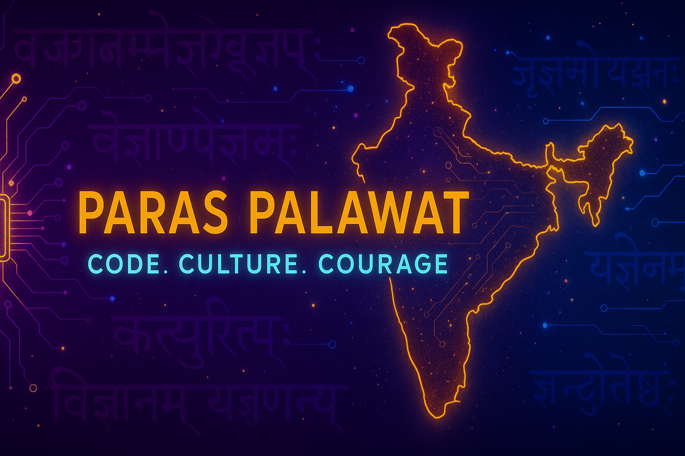

<h1 align="center">Hi 👋, I'm Paras Palawat</h1>
<h3 align="center">🚀 Passionate Developer | 🧠 Curious Learner | 🇮🇳 Bharat-First Tech Enthusiast</h3>

---

## 🧑‍💻 About Me

- 🎓 B.Tech CSE Student at **Eshan College of Engineering**
- 🔭 I’m currently building **[NirogAI – Bharat's AI Health Assistant](https://github.com/paraspalawat/nirogai)**
- 🛕 Creator of **[Satya Khooj – Ramayan Fact Checker](https://github.com/paraspalawat/ramayan-fact-checker)**
- 🚀 Exploring **Web Development**, **DSA**, and **AI/ML**
- 💡 I believe in using tech to empower real Bharat 🇮🇳
- 📚 Preparing to master **DSA before 2nd year**
- 🌐 Learning by building cool, useful, and Indian-centric projects!

---

## 🔗 My Featured Projects

| 🌟 Project | 🔧 Tech Stack | 📎 Link |
|-----------|--------------|---------|
| 🩺 NirogAI – Bharat's Health Assistant | HTML, CSS, JS, OpenRouter API | [GitHub Repo](https://github.com/paraspalawat/nirogai) |
| 🛕 Satya Khooj – Ramayan AI Checker | HTML, JS, LLM API | [GitHub Repo](https://github.com/paraspalawat/ramayan-fact-checker) |
| 💄 BlushBelle – E-Commerce Startup UI | HTML, CSS, JS | [GitHub Repo](https://github.com/paraspalawat/blushbelle) |
| ✨ Animated Card UI | HTML, CSS | [GitHub Repo](https://github.com/paraspalawat/animated-card) |

➡️ More at [github.com/paraspalawat?tab=repositories](https://github.com/paraspalawat?tab=repositories)

---

## 🛠️ Languages and Tools

  
  
  
  
  
  
  

---

## 📈 GitHub Stats

  
  

  

---

## 🏆 GitHub Trophies

  

---

## 📫 Connect With Me

  
  

---

  ❤️ Made with passion to create, learn and grow!

